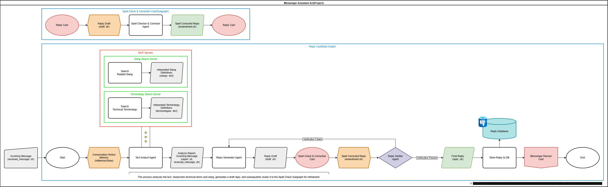

# Act Template

This document provides a quick guide to understand and properly use the project generated from this scaffold (template).

- Template name: My Summary Agent (slug: my-summary-agent, snake: my_summary_agent)
- Workspace configuration: `uv` multi-package (workspace) – `[tool.uv.workspace].members = ["casts/*"]`
- Graph registry: Graph entries are registered via the `graphs` key in `langgraph.json`

## Template Overview

- Provides a modular/hierarchical graph structure based on LangGraph.
- Individual Casts are managed as packages in the `casts/` directory (including `pyproject.toml`).
- Common base classes are imported from `casts/base_node.py` and `casts/base_graph.py`.
- Each Cast consists of `modules/` (agents/conditions/middlewares/models/nodes/prompts/state/tools/utils) and `graph.py`.
- State management uses separate schemas: `InputState` for inputs, `OutputState` for outputs, and `State` for internal processing.

### Directory Core Structure (Summary)

```
my-summary-agent/             #Root
├── casts/
│   ├── __init__.py
│   ├── base_node.py
│   ├── base_graph.py
│   └── orchestrator/
│       ├── modules/
│       │   ├── __init__.py
│       │   ├── agents.py (optional)
│       │   ├── conditions.py (optional)
│       │   ├── middlewares.py (optional)
│       │   ├── models.py (optional)
│       │   ├── nodes.py (required)
│       │   ├── prompts.py (optional)
│       │   ├── state.py (required)
│       │   ├── tools.py (optional)
│       │   └── utils.py (optional)
│       ├── __init__.py
│       ├── graph.py
│       ├── pyproject.toml
│       └── README.md
├── tests/
│   ├── __init__.py
│   ├── cast_tests/
│   └── node_tests/
├── langgraph.json
├── pyproject.toml
└── README.md
```

## Installation and Setup

### System Requirements

- Python 3.11 or higher
- `uv` (dependency/execution/build)
- `ruff` (code quality/formatting)

### Installing uv (if not installed)

- Official guide: https://docs.astral.sh/uv/getting-started/installation/

```bash
pip install uv
```

### Installing Dependencies

- Install entire workspace (all Cast packages)

```bash
uv sync --all-packages
```

- Install specific Cast package (using workspace member name)

```bash
# Example: Install only orchestrator
uv sync --package orchestrator
```

> Member names match the `[project].name` in each `pyproject.toml` under `casts/<cast_name>`.

## Graph Registry (langgraph.json)

Declare graphs to expose in `langgraph.json`. A basic example is as follows:

```json
{
  "dependencies": ["."],
  "graphs": {
    "main": "./casts/graph.py:main_graph",
    "orchestrator": "./casts/orchestrator/graph.py:orchestrator_graph"
  },
  "env": ".env"
}
```

- If you only use specific Casts, you can keep only those Cast keys.
- The `.env` path points to the environment variable file (modify if needed).

## Running Development Server (LangGraph CLI)

Run an in-memory server for development/debugging.

```bash
uv run langgraph dev
```

- For browsers other than Chrome (tunnel mode):

```bash
uv run langgraph dev --tunnel
```

Server URLs after startup

- API: http://127.0.0.1:2024
- Studio UI: https://smith.langchain.com/studio/?baseUrl=http://127.0.0.1:2024
- API Documentation: http://127.0.0.1:2024/docs

> Note: This server is an in-memory server for development/testing. For production, LangGraph Cloud is recommended.

To stop: Press `Ctrl + C` (Windows) or `Cmd + C` (macOS) in the terminal

## Input/State Management

- Each Cast uses three distinct state schemas defined in `casts/orchestrator/modules/state.py`:
  - **InputState**: Defines the input schema for graph invocation
  - **OutputState**: Defines the output schema returned by the graph
  - **State**: The main state container (inherits from `MessagesState` for message handling)
- When executing, specify values in the input fields displayed in the left panel of Studio UI, then click Invoke.
- The graph automatically validates input against `InputState` and formats output according to `OutputState`.

## Adding a New Cast

To add a new graph/feature as a separate Cast, use the `act cast` command. Act Operator is already included in the `dev` dependency group.

```bash
# Ensure dev dependencies are installed
uv sync --all-packages

# Add a new Cast (interactive mode)
uv run act cast

# Or specify cast name directly
uv run act cast my-new-cast

# Or with full options
uv run act cast --path . --cast-name "New Cast Name"
```

**What happens:**
- Validates Act project structure
- Creates complete Cast directory with all required files
- Updates `langgraph.json` automatically
- Configures Cast as workspace member

**After creating:**
```bash
# Install all packages (includes new Cast)
uv sync --all-packages
```

## Agent Skills

Agent Skills are folders of instructions that enable AI agents to **discover** capabilities, **activate** relevant context, and **execute** tasks. This project includes pre-configured skills in `.claude/skills/`.

> **Tool Compatibility**: The `.claude` folder name is optimized for Claude Code. If you are using other Agent Skills-compatible tools (e.g., Cursor, Gemini CLI), please rename the folder to match your tool's convention.

### Available Skills

| Skill | Purpose | When to Use |
|-------|---------|-------------|
| `@architecting-act` | Design architecture | Starting My Summary Agent Project, Planning new cast, unclear about structure, need CLAUDE.md (includes development commands) |
| `@developing-cast` | Implement code | Building nodes/agents/tools, need LangGraph patterns |
| `@testing-cast` | Write tests | Creating pytest tests, mocking strategies, fixtures |

### How to Use

Skills can be invoked in three ways:

1. **Manual invocation**: Type `@skill-name` in your prompt to explicitly load context.
   ```
   @architecting-act Help me design a RAG pipeline
   ```
2. **Programmatic invocation**: The agent automatically calls the skill via tool use.
3. **Automatic discovery**: The agent reads the Skill's description and loads it when relevant to the conversation.

### Skill Workflow

Skills guide you through their specific domain:
- `architecting-act`: Interactive Q&A → generates `CLAUDE.md` (includes development commands: dev server, sync, cast creation, dependency management)
- `developing-cast`: Reads `CLAUDE.md` (Optional) → implements code
- `testing-cast`: Creates pytest test files

### Recommended Development Flow

```
1. @architecting-act  →  Design & create CLAUDE.md (includes dev commands)
        ↓
2. @developing-cast   →  Implement nodes, agents, graphs
        ↓
3. @testing-cast      →  Write and run tests
```

## Architecture Diagram Kit

The `drawkit.xml` file included in the root directory contains pre-defined shapes for designing Act architecture in [draw.io](https://app.diagrams.net/).

> **Note**: This kit is intended for **human-to-human communication**.
> - For **agent-to-agent communication**, use the Mermaid charts in `CLAUDE.md` generated by the `@architecting-act` skill.
> - For **Developers**, inspect the actual graph execution flow via the LangGraph Development Server (LangSmith).

<p align="center">
  <picture>
    <source media="(prefers-color-scheme: dark)" srcset=".github/images/drawkit-dark-en-theme.png">
    
  </picture>
</p>

### How to Import

1. Open [draw.io](https://app.diagrams.net/).
2. Expand the **Scratchpad** panel on the left sidebar.
3. Click the **Edit** (pencil icon) button on the Scratchpad header.
4. Copy the contents of `drawkit.xml` and paste them into the dialog, or use the **Import** button.
5. Click **Save**. The Act components will appear in your Scratchpad for drag-and-drop use.

### Example Act Flowchart

<p align="center">
  <picture>
    <source media="(prefers-color-scheme: dark)" srcset=".github/images/sample-flowchart-en-dark-theme.png">
    
  </picture>
</p>

## Node Implementation

### Creating Nodes

Each Cast includes two types of base nodes for different use cases:

- **BaseNode**: For synchronous operations (file I/O, database queries)
- **AsyncBaseNode**: For asynchronous operations (API calls, concurrent tasks)

### Node Signatures

Choose the appropriate signature based on what your node needs:

```python
# Simple - only needs state
def execute(self, state):
    return {"result": "value"}

# With config - needs thread_id, tags, etc.
def execute(self, state, config):
    thread_id = config.get("configurable", {}).get("thread_id")
    return {"result": "value"}

# With runtime - needs store, stream capabilities
def execute(self, state, runtime):
    runtime.store.put(("memories", "1"), {"key": "value"})
    return {"result": "value"}

# Full - needs everything
def execute(self, state, config, runtime):
    # Access all capabilities
    return {"result": "value"}
```

### Example Implementation

See `casts/orchestrator/modules/nodes.py` for working examples of both `SampleNode` (sync) and `AsyncSampleNode` (async).

## Testing and Quality Management

### Testing (pytest)

```bash
uv run pytest -q
```

### Quality Management (ruff)

```bash
uv run ruff check . --fix
uv run ruff format .
```

### pre-commit

This template includes pre-commit configuration.

- `ruff`: Code quality checks/formatting/import organization
- `uv-lock`: Dependency lock file synchronization

> If checks fail, the commit will be blocked. All hooks must pass for the commit to complete.

## License
The structure and tooling of this monorepo template are licensed under the Proact0's [Apache 2.0 License](LICENSE).

## Frequently Asked Questions (FAQ)

- Q. Can I minimize dependency installation when developing only specific Casts?
  - A. Use `uv sync --package <package_name>` to install only the required Casts.
- Q. I added a new graph key, but it doesn't appear in Studio UI.
  - A. Check that it's registered with the correct path (`path:callable`) in the `graphs` section of `langgraph.json`, and restart the server.
- Q. Where can I check the format/lint standards?
  - A. Check the `[tool.ruff]` settings in `pyproject.toml`.

## References

- LangGraph: https://docs.langchain.com/oss/python/langgraph/overview
- Claude Agent Skills: https://platform.claude.com/docs/en/agents-and-tools/agent-skills/overview
- uv: https://docs.astral.sh/uv/

---

**This template is powered by [Proact0](https://www.proact0.org/)**
