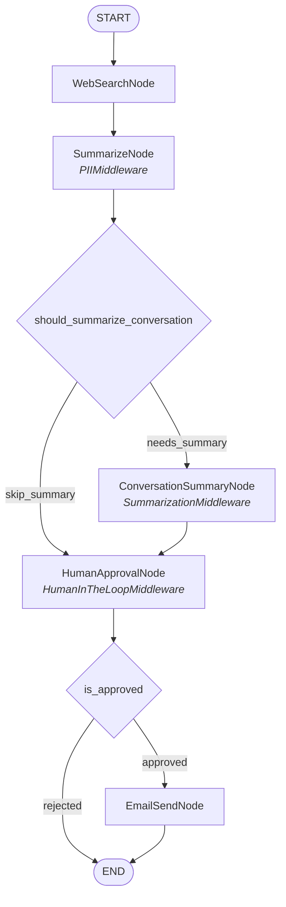

# Cast: Orchestrator

<!-- AUTO-MANAGED: cast-overview -->
## Overview

**Purpose:** 토픽 기반 웹 검색 결과를 구조화된 형태로 요약하고, 미들웨어 기반 Human-in-the-Loop 승인 절차를 거쳐 이메일로 발송
**Pattern:** Sequential + Conditional + Middleware
**Latency:** Normal (<60s)

<!-- END AUTO-MANAGED -->

<!-- AUTO-MANAGED: architecture-diagram -->
## Architecture Diagram



### Conditions (conditions.py)

| Function | Input | Logic | Returns |
|----------|-------|-------|---------|
| `should_summarize_conversation` | messages | `len(messages) > threshold` | `"needs_summary"` \| `"skip_summary"` |
| `is_approved` | is_approved | `is_approved == True` | `"approved"` \| `"rejected"` |

### Middleware (middlewares.py)

| Middleware | Applied To | Behavior |
|-----------|-----------|----------|
| PIIMiddleware | SummarizeNode | 노드 출력의 summary에서 이메일/전화번호 등 PII 패턴 탐지 후 마스킹 |
| SummarizationMiddleware | ConversationSummaryNode | messages를 LLM으로 요약하여 압축된 대화 히스토리로 교체 |
| HumanInTheLoopMiddleware | HumanApprovalNode | `interrupt()`로 사용자에게 요약 표시 + 이메일/승인 수집 |

<!-- END AUTO-MANAGED -->

<!-- AUTO-MANAGED: state-schema -->
## State Schema

### InputState

| Field | Type | Description |
|-------|------|-------------|
| messages | `Annotated[list[AnyMessage], add_messages]` | 사용자 채팅 입력 (MessagesState 상속) |

> InputState는 `MessagesState`를 상속하여 LangGraph Studio 채팅 UI와 호환됩니다. `topic`은 `messages[-1].content`에서 추출합니다.

### OutputState

| Field | Type | Description |
|-------|------|-------------|
| summary | `str` | 구조화된 요약 결과 (PII 필터링 적용) |
| email_sent | `bool` | 이메일 발송 성공 여부 |

### OverallState

| Field | Type | Category | Description |
|-------|------|----------|-------------|
| topic | `str` | Internal | 검색할 토픽 (messages에서 추출) |
| search_results | `list[dict]` | Internal | 웹 검색 원본 결과 |
| summary | `str` | Output | 구조화된 요약 (PII 필터링 적용) |
| recipient_email | `str` | Internal | 수신자 이메일 |
| is_approved | `bool` | Internal | 이메일 발송 승인 여부 |
| email_sent | `bool` | Output | 이메일 발송 성공 여부 |
| messages | `Annotated[list[AnyMessage], add_messages]` | Internal | LLM 대화 히스토리 (MessagesState 상속) |

<!-- END AUTO-MANAGED -->

<!-- AUTO-MANAGED: node-specifications -->
## Node Specifications

### WebSearchNode

| Attribute | Value |
|-----------|-------|
| Responsibility | 입력된 토픽으로 Tavily 웹 검색 수행 |
| Reads | messages (topic 추출) |
| Writes | topic, search_results |

### SummarizeNode

| Attribute | Value |
|-----------|-------|
| Responsibility | 검색 결과를 구조화된 형태로 Gemini 요약 |
| Reads | topic, search_results |
| Writes | summary, messages |
| Middleware | PIIMiddleware — 요약 출력에서 개인정보 자동 마스킹 |

### ConversationSummaryNode

| Attribute | Value |
|-----------|-------|
| Responsibility | 대화 히스토리가 threshold 초과 시 자동 요약하여 토큰 최적화 |
| Reads | messages |
| Writes | messages (요약된 메시지로 교체) |
| Middleware | SummarizationMiddleware — 메시지 수 기반 자동 요약 로직 |

### HumanApprovalNode

| Attribute | Value |
|-----------|-------|
| Responsibility | 요약 결과 표시 + 수신자 이메일 입력 + 발송 승인/거부 (interrupt 사용) |
| Reads | summary |
| Writes | recipient_email, is_approved |
| Middleware | HumanInTheLoopMiddleware — interrupt 기반 사용자 승인 절차 |

### EmailSendNode

| Attribute | Value |
|-----------|-------|
| Responsibility | Resend API로 지정된 수신자에게 요약 이메일 발송 |
| Reads | topic, summary, recipient_email |
| Writes | email_sent |

<!-- END AUTO-MANAGED -->

<!-- AUTO-MANAGED: technology-stack -->
## Technology Stack

> Note: `langgraph`, `langchain` are already in template. List only **additional** dependencies for this Cast.

### Additional Dependencies

| Package | Purpose |
|---------|---------|
| `langchain-google-genai` | Google Gemini LLM 통합 (요약 + 대화 요약) |
| `langchain-tavily` | Tavily 웹 검색 통합 |
| `resend` | Resend 이메일 발송 API |

### Environment Variables

| Variable | Required | Description |
|----------|----------|-------------|
| `GOOGLE_API_KEY` | Yes | Google Gemini API 키 |
| `TAVILY_API_KEY` | Yes | Tavily 검색 API 키 |
| `RESEND_API_KEY` | Yes | Resend 이메일 API 키 |
| `RESEND_FROM_EMAIL` | No | 발신자 이메일 (기본값: onboarding@resend.dev) |

<!-- END AUTO-MANAGED -->

<!-- AUTO-MANAGED: cast-structure -->
## Cast Structure

```
casts/orchestrator/
├── CLAUDE.md                # Cast-level architecture doc (THIS FILE)
├── graph.py                 # Graph definition (StateGraph, nodes, edges, conditional edges)
├── pyproject.toml           # Cast-specific dependencies
├── README.md                # Cast documentation
└── modules/                 # Implementation modules
    ├── __init__.py          # Module exports
    ├── state.py             # State definitions (InputState, OutputState, OverallState)
    ├── nodes.py             # Node implementations
    ├── conditions.py        # Conditional edge functions (should_summarize_conversation, is_approved)
    ├── agents.py            # Agent configurations (if using Agentic patterns)
    ├── tools.py             # Tool definitions for agents
    ├── prompts.py           # Prompt templates
    ├── models.py            # Pydantic models / Structured outputs
    ├── middlewares.py       # Middleware (PIIMiddleware, SummarizationMiddleware, HumanInTheLoopMiddleware)
    └── utils.py             # Utility functions
```

<!-- END AUTO-MANAGED -->

<!-- AUTO-MANAGED: development-commands -->
## Development Commands

### Add Cast Dependency

Add dependency to this cast only.

```bash
uv add --package orchestrator <package>      # Add
uv remove --package orchestrator <package>   # Remove
```

After adding, update the Technology Stack section above.

<!-- END AUTO-MANAGED -->

<!-- MANUAL -->
## Notes

### 변경 이력

- **v2**: Sequential + Conditional + Middleware 패턴으로 재설계
  - ConversationSummaryNode 추가 (대화 자동 요약)
  - HumanReviewNode → HumanApprovalNode (승인/거부 분기 추가)
  - 조건부 엣지 2개: should_summarize_conversation, is_approved
  - 미들웨어 3개: PIIMiddleware, SummarizationMiddleware, HumanInTheLoopMiddleware
- **v1**: Sequential + Human-in-the-Loop 기본 패턴

<!-- END MANUAL -->
