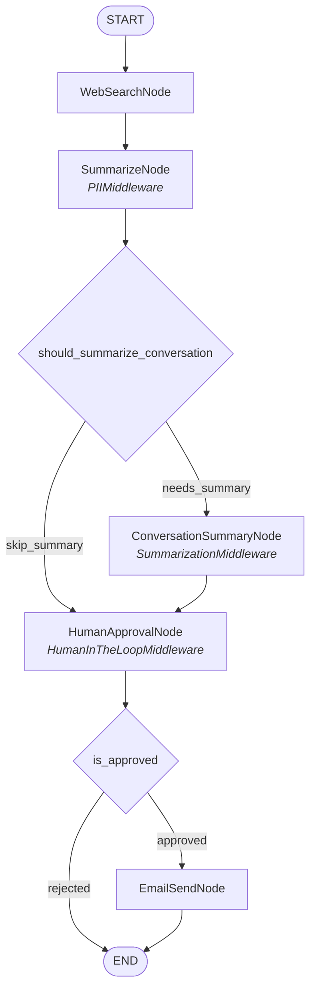

# PRD: My Summary Agent

## 1. 개요

### 1.1 제품명
My Summary Agent

### 1.2 한줄 설명
사용자가 입력한 토픽에 대해 웹 검색 후 결과를 구조화된 형태로 요약하고, 사용자 승인을 거쳐 이메일로 전달하는 AI 에이전트

### 1.3 도메인
Information Retrieval & Summarization

### 1.4 제품 유형
LangGraph 기반 AI 워크플로우 에이전트 (LangGraph Platform 배포)

---

## 2. 배경 및 문제 정의

### 2.1 문제
- 특정 토픽에 대한 최신 정보를 수집하려면 여러 웹 페이지를 직접 검색하고 읽어야 하는 반복적인 수작업이 필요하다.
- 수집한 정보를 팀원이나 이해관계자에게 공유하려면 별도로 요약 문서를 작성하고 이메일을 작성해야 한다.
- 이 과정에서 개인정보(이메일, 전화번호 등)가 무의식적으로 포함될 수 있는 보안 리스크가 있다.

### 2.2 해결 방향
토픽 입력 한 번으로 웹 검색 → 구조화된 요약 → 사용자 검토 → 이메일 발송까지의 전 과정을 자동화한다. 사용자는 최종 결과를 검토하고 승인/거부만 결정하면 된다.

### 2.3 대상 사용자
- 리서치 업무가 잦은 비즈니스 전문가
- 팀에 정보를 정기적으로 공유해야 하는 팀 리드/매니저
- 빠른 시장 조사가 필요한 기획자/PM

---

## 3. 사용자 스토리

### US-1: 토픽 기반 요약 생성
> **As a** 비즈니스 전문가,
> **I want to** 토픽을 입력하면 웹 검색 결과가 자동으로 요약되기를,
> **So that** 직접 여러 사이트를 돌아다니며 정보를 수집하는 시간을 절약할 수 있다.

**수락 기준:**
- 토픽 입력 시 Tavily API를 통해 최대 5개 검색 결과를 수집한다.
- 검색 결과를 한줄 요약, 핵심 포인트 5개, 키워드 5개, 상세 요약으로 구조화한다.
- 요약은 한국어로 생성된다.
- 요약 결과에서 개인정보(이메일, 전화번호, 카드번호)는 자동으로 마스킹된다.

### US-2: 이메일 발송 전 승인
> **As a** 사용자,
> **I want to** 요약 결과를 검토하고 이메일 발송을 승인 또는 거부할 수 있기를,
> **So that** 부정확하거나 불필요한 정보가 잘못 전달되는 것을 방지할 수 있다.

**수락 기준:**
- 요약 결과가 사용자에게 표시되고, 그래프 실행이 일시 중지(interrupt)된다.
- 사용자가 수신자 이메일을 입력하면 발송이 승인된다.
- 사용자가 "reject"를 입력하면 이메일 발송 없이 워크플로우가 종료된다.

### US-3: 이메일 자동 발송
> **As a** 사용자,
> **I want to** 승인 후 지정한 수신자에게 요약 이메일이 자동으로 발송되기를,
> **So that** 별도로 이메일을 작성하고 복사/붙여넣기하는 수고를 덜 수 있다.

**수락 기준:**
- Resend API를 통해 이메일이 발송된다.
- 이메일 제목은 `[Summary] {토픽}` 형식이다.
- 이메일 본문은 HTML 형식으로 요약 내용을 포함한다.
- 발송 성공 여부(`email_sent`)가 최종 출력에 포함된다.
- 발송 실패 시 에러 없이 `email_sent: false`를 반환한다.

### US-4: 대화 이력 자동 요약
> **As a** 시스템,
> **I want to** 대화 이력이 길어지면 자동으로 요약하여 토큰 사용량을 최적화하기를,
> **So that** 장시간 사용 시에도 안정적인 성능을 유지할 수 있다.

**수락 기준:**
- 메시지 수가 6개(MESSAGE_THRESHOLD)를 초과하면 ConversationSummaryNode로 분기한다.
- 기존 메시지를 LLM으로 요약한 후, 이전 메시지를 삭제하고 요약 SystemMessage로 교체한다.
- 메시지 수가 임계값 이하이면 요약을 건너뛴다.

---

## 4. 기능 요구사항

### 4.1 핵심 기능

| ID | 기능 | 우선순위 | 상태 |
|----|------|----------|------|
| F-1 | Tavily 기반 웹 검색 (최대 5개 결과) | P0 | 구현 완료 |
| F-2 | Gemini 기반 구조화된 요약 생성 | P0 | 구현 완료 |
| F-3 | PII 자동 마스킹 (이메일, 전화, 카드) | P0 | 구현 완료 |
| F-4 | Human-in-the-Loop 승인/거부 | P0 | 구현 완료 |
| F-5 | Resend API 이메일 발송 | P0 | 구현 완료 |
| F-6 | 조건부 분기: 대화 요약 필요 여부 | P1 | 구현 완료 |
| F-7 | 조건부 분기: 승인/거부 라우팅 | P1 | 구현 완료 |
| F-8 | 대화 이력 자동 요약 (토큰 최적화) | P1 | 구현 완료 |
| F-9 | Agent Middleware 팩토리 함수 (HITL, PII, Summarization) | P2 | 구현 완료 |

### 4.2 비기능 요구사항

| ID | 요구사항 | 기준 |
|----|----------|------|
| NF-1 | 응답 시간 | 전체 워크플로우 60초 이내 (interrupt 대기 시간 제외) |
| NF-2 | LangGraph Studio 호환 | MessagesState 기반 채팅 UI 지원 |
| NF-3 | LangGraph Platform 배포 | `langgraph.json` 설정으로 원클릭 배포 |
| NF-4 | 테스트 커버리지 | 단위 테스트 33개 + 통합 테스트 8개 = 41개 전체 통과 |

---

## 5. 시스템 아키텍처

### 5.1 기술 스택

| 레이어 | 기술 | 버전/설명 |
|--------|------|-----------|
| 프레임워크 | LangGraph | 워크플로우 오케스트레이션 |
| LLM | Google Gemini 2.0 Flash | 요약 + 대화 요약 |
| 검색 | Tavily API | 웹 검색 (최대 5개 결과) |
| 이메일 | Resend API | 트랜잭셔널 이메일 발송 |
| 패키지 관리 | uv | Python 패키지 및 워크스페이스 관리 |
| 런타임 | Python 3.11+ | 프로덕션 환경 |

### 5.2 워크플로우 다이어그램



### 5.3 패턴
**Sequential + Conditional + Middleware**

- **Sequential**: 웹 검색 → 요약 → 승인 → 이메일의 기본 순차 흐름
- **Conditional**: `should_summarize_conversation`과 `is_approved` 두 개의 조건부 엣지로 동적 라우팅
- **Middleware**: PIIMiddleware(개인정보 보호), SummarizationMiddleware(토큰 최적화), HumanInTheLoopMiddleware(승인 절차) 세 가지 횡단 관심사 분리

### 5.4 노드 사양

| 노드 | 역할 | 입력 | 출력 | 미들웨어 |
|------|------|------|------|----------|
| WebSearchNode | Tavily 웹 검색 수행 | messages | topic, search_results | - |
| SummarizeNode | Gemini로 구조화된 요약 생성 | topic, search_results | summary, messages | PIIMiddleware |
| ConversationSummaryNode | 긴 대화 이력 자동 요약 | messages | messages (교체) | SummarizationMiddleware |
| HumanApprovalNode | 사용자 검토 + 이메일/승인 수집 | summary | recipient_email, is_approved | HumanInTheLoopMiddleware |
| EmailSendNode | Resend API 이메일 발송 | topic, summary, recipient_email | email_sent | - |

### 5.5 상태 스키마

**입력:** `MessagesState` (LangGraph Studio 채팅 UI 호환)

**출력:**
| 필드 | 타입 | 설명 |
|------|------|------|
| summary | str | 구조화된 요약 (PII 필터링 적용) |
| email_sent | bool | 이메일 발송 성공 여부 |

**내부 상태:**
| 필드 | 타입 | 설명 |
|------|------|------|
| topic | str | 검색 토픽 |
| search_results | list[dict] | 웹 검색 원본 결과 |
| recipient_email | str | 수신자 이메일 |
| is_approved | bool | 발송 승인 여부 |
| messages | list[AnyMessage] | LLM 대화 히스토리 |

---

## 6. 외부 의존성

### 6.1 API 키

| 서비스 | 환경변수 | 필수 | 발급처 |
|--------|----------|------|--------|
| Google Gemini | `GOOGLE_API_KEY` | Yes | https://aistudio.google.com/apikey |
| Tavily Search | `TAVILY_API_KEY` | Yes | https://tavily.com/ |
| Resend Email | `RESEND_API_KEY` | Yes | https://resend.com/ |
| Resend 발신자 | `RESEND_FROM_EMAIL` | No | 기본값: onboarding@resend.dev |
| LangSmith | `LANGSMITH_API_KEY` | No | 선택적 모니터링/추적 |

### 6.2 Python 패키지

| 패키지 | 용도 |
|--------|------|
| `langgraph` | 워크플로우 그래프 엔진 |
| `langchain` | LLM 통합 프레임워크 |
| `langchain-google-genai` | Gemini 모델 연동 |
| `langchain-tavily` | Tavily 검색 연동 |
| `resend` | 이메일 발송 API 클라이언트 |

---

## 7. 요약 출력 형식

```
## 한줄 요약
[핵심 발견 사항 한 문장]

## 핵심 포인트
- [포인트 1]
- [포인트 2]
- [포인트 3]
- [포인트 4]
- [포인트 5]

## 키워드
[키워드1], [키워드2], [키워드3], [키워드4], [키워드5]

## 상세 요약
[2~3 문단의 상세 요약]
```

---

## 8. 보안 및 개인정보 보호

### 8.1 PII 자동 마스킹
SummarizeNode 출력에 `apply_pii_filter()`가 적용되어 다음 패턴을 자동으로 마스킹한다:

| PII 유형 | 패턴 | 마스킹 결과 |
|----------|------|------------|
| 이메일 | `user@example.com` | `[EMAIL_REDACTED]` |
| 전화번호 | `010-1234-5678` | `[PHONE_REDACTED]` |
| 카드번호 | `1234-5678-9012-3456` | `[CARD_REDACTED]` |

### 8.2 정규식 적용 순서
카드번호(16자리) → 이메일 → 전화번호(10~11자리) 순으로 적용하여 패턴 충돌을 방지한다.

---

## 9. 테스트 전략

### 9.1 단위 테스트 (33개)

| 테스트 클래스 | 테스트 수 | 검증 대상 |
|--------------|----------|----------|
| TestApplyPiiFilter | 7 | PII 필터링 정확성, 패턴 충돌 방지 |
| TestShouldSummarizeConversation | 3 | 조건부 엣지 threshold 기반 분기 |
| TestIsApproved | 3 | 조건부 엣지 승인/거부 분기 |
| TestWebSearchNode | 2 | Tavily 검색 + 토픽 추출 |
| TestSummarizeNode | 6 | Gemini 요약 + PII 필터 적용 |
| TestConversationSummaryNode | 3 | 대화 요약 + 메시지 교체 |
| TestHumanApprovalNode | 5 | interrupt 승인/거부/대소문자/공백 |
| TestEmailSendNode | 4 | Resend 성공/실패/커스텀 발신자 |

### 9.2 통합 테스트 (8개)

| 테스트 클래스 | 테스트 수 | 검증 대상 |
|--------------|----------|----------|
| TestGraphCompilation | 4 | 컴파일, 5개 노드, 이름 |
| TestGraphExecutionApproved | 3 | 승인 흐름 (interrupt → resume → email) |
| TestGraphExecutionRejected | 1 | 거부 흐름 (interrupt → reject → END) |

### 9.3 테스트 실행
```bash
uv run python -m pytest tests/ -v
```

---

## 10. 프로젝트 구조

```
my-summary-agent/
├── CLAUDE.md                    # Act-level 아키텍처 문서
├── pyproject.toml               # 프로젝트 의존성
├── langgraph.json               # LangGraph Platform 설정
├── .env.example                 # 환경변수 템플릿
├── docs/
│   └── prd.md                   # 이 문서
├── casts/
│   ├── __init__.py
│   ├── base_graph.py            # BaseGraph 추상 클래스
│   ├── base_node.py             # BaseNode / AsyncBaseNode 클래스
│   └── orchestrator/            # Orchestrator Cast
│       ├── CLAUDE.md            # Cast-level 아키텍처 문서
│       ├── graph.py             # 그래프 정의 (노드 + 엣지 + 조건부 엣지)
│       ├── pyproject.toml       # Cast 의존성
│       └── modules/
│           ├── state.py         # InputState, OutputState, State
│           ├── nodes.py         # 5개 노드 구현
│           ├── conditions.py    # 2개 조건부 엣지 함수
│           ├── middlewares.py   # 3개 미들웨어 (standalone + agent factory)
│           ├── prompts.py       # 프롬프트 템플릿
│           └── models.py        # Gemini 모델 설정
└── tests/
    ├── node_tests/
    │   └── test_node.py         # 단위 테스트 (33개)
    └── cast_tests/
        └── orchestrator_test.py # 통합 테스트 (8개)
```

---

## 11. 제약사항 및 한계

| 항목 | 현재 상태 | 비고 |
|------|----------|------|
| LLM 모델 | Gemini 2.0 Flash 고정 | 모델 선택 UI 미제공 |
| 검색 결과 수 | 최대 5개 고정 | 사용자 설정 불가 |
| 언어 | 한국어 요약만 지원 | 프롬프트가 한국어 고정 |
| 이메일 형식 | HTML 단순 변환 (`\n` → `<br>`) | 마크다운 렌더링 미지원 |
| 에러 처리 | EmailSendNode만 try/except | WebSearchNode, SummarizeNode는 에러 전파 |
| HTML 이스케이핑 | 미적용 | LLM 출력의 HTML 태그가 이메일에 그대로 삽입 |
| 동시 실행 | `resend.api_key` 전역 설정 | 단일 인스턴스 환경에서는 문제 없음 |

---

## 12. 향후 로드맵

| 우선순위 | 기능 | 설명 |
|----------|------|------|
| P1 | 다국어 요약 지원 | 프롬프트 언어 선택 (한국어/영어/일본어) |
| P1 | 마크다운 → HTML 변환 | 이메일 본문을 리치 HTML로 렌더링 |
| P2 | 검색 결과 수 설정 | 사용자가 검색 깊이를 조절 |
| P2 | 요약 품질 평가 루프 | LLM 자체 평가 → 품질 미달 시 재요약 (Cyclic 패턴) |
| P2 | 에러 처리 강화 | 모든 노드에 구조화된 에러 핸들링 + 로깅 |
| P3 | 정기 실행 스케줄러 | 매일/매주 자동으로 토픽 요약 생성 및 발송 |
| P3 | 다중 수신자 지원 | 여러 이메일 주소에 동시 발송 |
| P3 | 첨부 파일 지원 | 요약 결과를 PDF로 첨부 |
